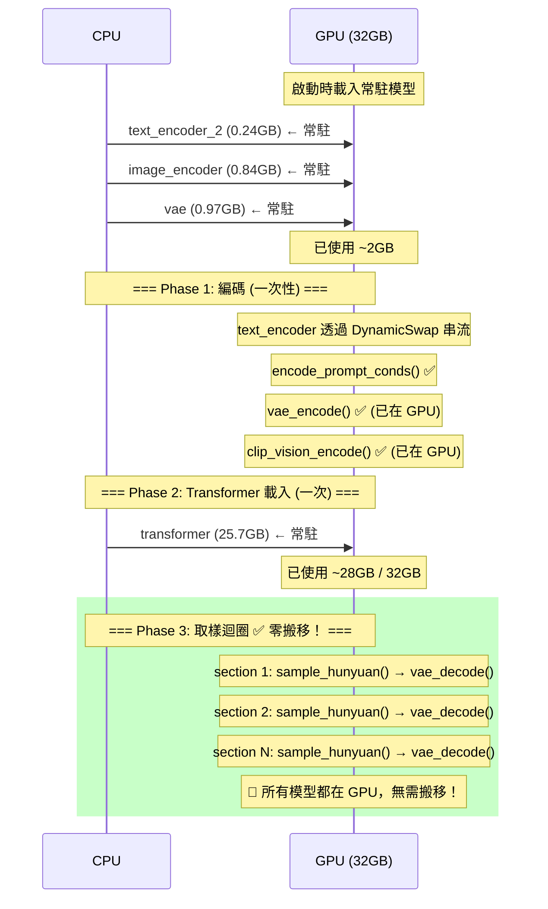

```mermaid
sequenceDiagram
    participant CPU
    participant GPU as GPU (32GB)
    
    Note over GPU: 啟動時載入常駐模型
    CPU->>GPU: text_encoder_2 (0.24GB) ← 常駐
    CPU->>GPU: image_encoder (0.84GB) ← 常駐
    CPU->>GPU: vae (0.97GB) ← 常駐
    Note over GPU: 已使用 ~2GB
    
    Note over CPU,GPU: === Phase 1: 編碼 (一次性) ===
    Note over GPU: text_encoder 透過 DynamicSwap 串流
    Note over GPU: encode_prompt_conds() ✅
    Note over GPU: vae_encode() ✅ (已在 GPU)
    Note over GPU: clip_vision_encode() ✅ (已在 GPU)
    
    Note over CPU,GPU: === Phase 2: Transformer 載入 (一次) ===
    CPU->>GPU: transformer (25.7GB) ← 常駐
    Note over GPU: 已使用 ~28GB / 32GB
    
    rect rgb(200, 255, 200)
        Note over CPU,GPU: === Phase 3: 取樣迴圈 ✅ 零搬移！ ===
        Note over GPU: section 1: sample_hunyuan() → vae_decode()
        Note over GPU: section 2: sample_hunyuan() → vae_decode()
        Note over GPU: section N: sample_hunyuan() → vae_decode()
        Note over GPU: 🚀 所有模型都在 GPU，無需搬移！
    end
```