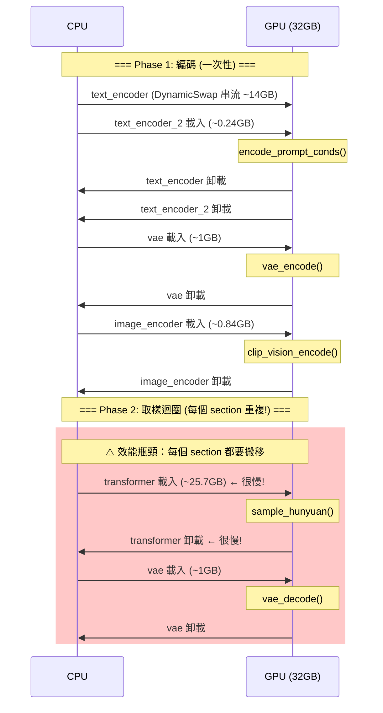

```mermaid
sequenceDiagram
    participant CPU
    participant GPU as GPU (32GB)
    
    Note over CPU,GPU: === Phase 1: 編碼 (一次性) ===
    CPU->>GPU: text_encoder (DynamicSwap 串流 ~14GB)
    CPU->>GPU: text_encoder_2 載入 (~0.24GB)
    Note over GPU: encode_prompt_conds()
    GPU->>CPU: text_encoder 卸載
    GPU->>CPU: text_encoder_2 卸載
    
    CPU->>GPU: vae 載入 (~1GB)
    Note over GPU: vae_encode()
    GPU->>CPU: vae 卸載
    
    CPU->>GPU: image_encoder 載入 (~0.84GB)
    Note over GPU: clip_vision_encode()
    GPU->>CPU: image_encoder 卸載
    
    Note over CPU,GPU: === Phase 2: 取樣迴圈 (每個 section 重複!) ===
    
    rect rgb(255, 200, 200)
        Note over CPU,GPU: ⚠️ 效能瓶頸：每個 section 都要搬移
        CPU->>GPU: transformer 載入 (~25.7GB) ← 很慢!
        Note over GPU: sample_hunyuan()
        GPU->>CPU: transformer 卸載 ← 很慢!
        CPU->>GPU: vae 載入 (~1GB)
        Note over GPU: vae_decode()
        GPU->>CPU: vae 卸載
    end
```